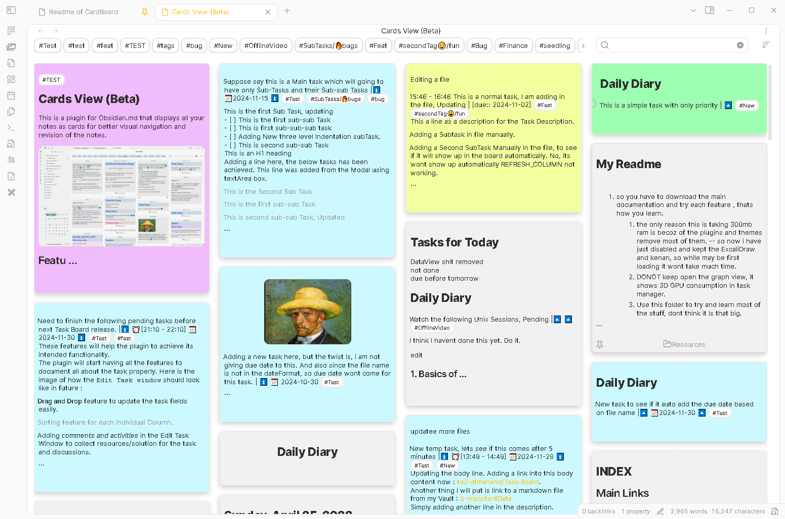

# Notes Explorer

This is a plugin for [Obsidian.md](https://obsidian.md) that displays all your notes as cards for better visual navigation and revision of your notes. Explore your vault using the explorer view by using various filters.



>[!IMPORTANT] Notice
> Initially started as simple fork from the Cards View plugin, now has become a highly functional plugin in itself with a lot of new functionalities. I started integrating all these new features to explore vault efficiently. Although, now after hearing few suggestion from the users, I have decided to publish my own new plugin with all these new changes, as I presume, the author of the Cards View might not be interested in integrating all these new features. This Beta version will be now published with a new name : **Notes Explorer**.

## Features

- Display notes as cards arranged in a masonry view.
- Sorts by last modified time, created time and note filename either as ascending or descending order.
- Filter out empty notes.
- See notes from specificc folders using Folder tag. Also use sub-folder filter to view all notes from even the sub-folders.
- Click on folder name from file explorer to open the explorer view.
- Two different types of tag based color indicators.

## Installation

> This plugin is in the process of publishing on the Obsidian plugin marketplace. But till it gets approved, use the following steps to install this plugin the easiest way.

**Step 1 :** Disable the original **Cards View** plugin or you can even uninstall it, but its better to disable : 

`Open Obsidian settings` > `Community plugins` > `search for the Cards View plugin` > `Click on the toggle button to disable it.`

**Step 2:** Install [**Brat plugin**](obsidian://show-plugin?id=obsidian42-brat).

`Open Obsidian settings` > `Community plugins` > `click on Browse button` > `search for Brat` > `Install and Enable`.

**Step 3 :** Add this plugin into the Brat beta plugin list. See below gif :


`Open Obsidian settings` > `BRAT` > `Add Beta plugin button` > `Paste the below link` > `Click on Add Plugin`.

```md
https://github.com/tu2-atmanand/obsidian-notes-explorer
```

**Step 4 :** Thats it! Now you can open the Cards View, as usual.

## Contributing

Pull requests and any suggestion for features or improvements are always welcome. Create your new request in the Issues section, to start the discussion : [Notes Explorer Issues](https://github.com/tu2-atmanand/obsidian-notes-explorer).

## License

[MIT](https://choosealicense.com/licenses/mit/)

## Credits

This project uses the following dependencies:

- [Masonry](https://masonry.desandro.com/). Licensed under the [MIT License](https://desandro.mit-license.org/).

## Support

If you liked the additional features and enjoyed using this plugin. Please consider sponsoring my work through small donation using the below links to keep the development and support for this plugin alive.

[](https://github.com/sponsors/tu2-atmanand)

<a href="https://www.buymeacoffee.com/tu2_atmanand"></a>