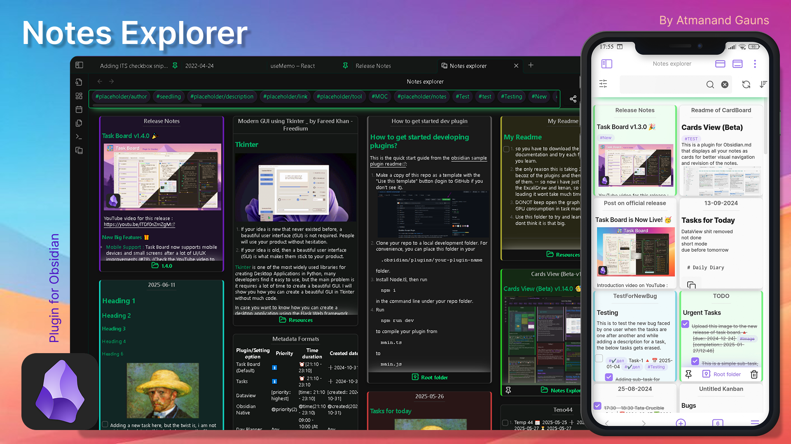
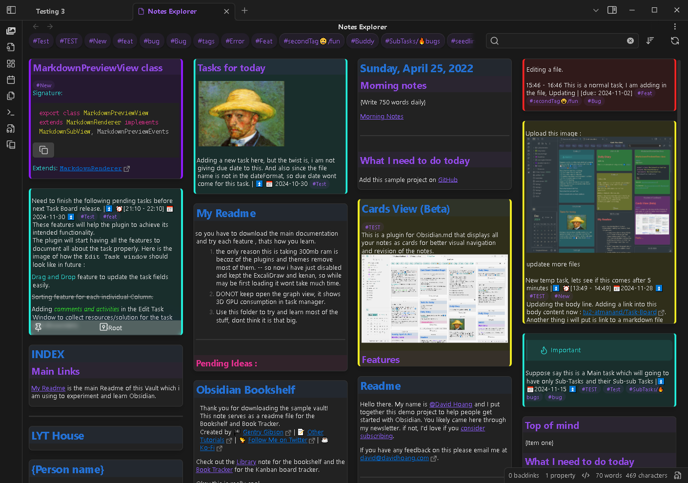
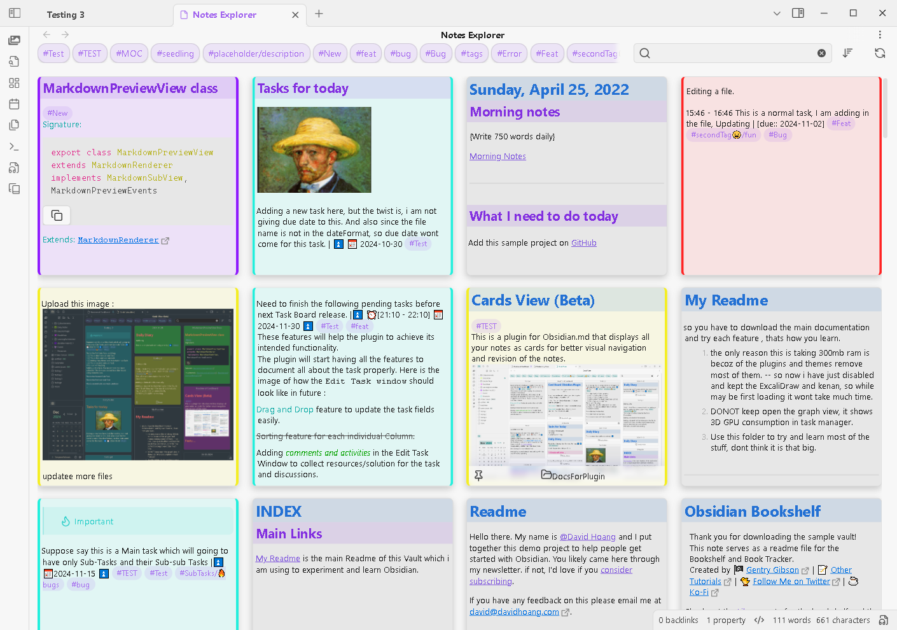

<p align="center">
	<h1 align="center"><b>Notes Explorer</b></h1>
	<h3 align="center"><b>"Explorer your notes as cards and advanced filters"</b></h3>
</p>
<br/>
<p align="center">
    <a href="https://github.com/tu2-atmanand/obsidian-notes-explorer/stargazers"></a>
    <a href="https://github.com/tu2-atmanand/obsidian-notes-explorer/issues"></a>
    <a href="https://github.com/tu2-atmanand/obsidian-notes-explorer/contributors"></a>
    <br/>
	<a href="https://obsidian.md/plugins?id=notes-explorer"></a>
<!-- 	<a href=""></a> -->
	<a href="[https://img.shields.io/github/v/release/tu2-atmanand/obsidian-notes-explorer?style=flat-square](https://img.shields.io/github/v/release/tu2-atmanand/obsidian-notes-explorer)">
    <a href="./LICENSE"></a>
</a>
</p>
<br/>



This is a plugin for [Obsidian.md](https://obsidian.md) that displays all your notes as cards for better visual navigation and revision of your notes. Explore your vault using the explorer view by using various filters.


## Two different views

Using the settings to set the **fixed height** of the cards and to set the **number of lines** to read from your notes, you can achieve two kinds of views. As shown below :

### 1. Masonry view

Leave the field blank for the setting **"Fixed card height"**.  And if you want you can increase the number of lines to be read from your notes in the setting **"Maximum number of lines"**, and you can achieve a view like the one shown below:


<P align="center"><b>Masonry view</b> - variable card height</p>

### 1. Grid view
Set some value for the setting **"Fixed card height"**. And all the cards will be restricted to have a fixed height as per the value in pixel, giving the whole view a grid look, something like shown below :


<P align="center"><b>Gallery view</b> - fixed card height</p>

## Features

- **Two view types :** Display notes as cards arranged in a masonry view or Gallery view.
- **Various sorting criteria:** Sorts by last modified time, created time and note filename either as ascending or descending order.
- **Folter tag :** Click on the folder name from file tree to open specific folder notes. Toggle *read-subfolders* filter, if needed.
- **Automatic card background color :** Two different types of tag based color indicators (background color and sidebars).
- **Search filters :** Apply various kinds of filters to the view to find your notes faster directly from the search bar.
- **Search history** : Store your searches to easily apply them in the future.
- **Link filtered views :** Use the Obsidian URI links to save the filtered Notes Explorer view for future quick reference.
- **Different open note layout :** Use different setting option to open the note, the way you want.
- **UI optimizations for mobile :** A ton of UI/UX enhancements to get a better experience even on small screens.

>[!IMPORTANT]
> **Notice :** Initially started as simple fork from the [Cards View plugin](https://github.com/jillro/obsidian-cards-view-plugin), now has become a highly functional plugin in itself with a lot of new functionalities. I started integrating all these new features for my personal use-case. But, now after hearing the suggestions from few of the users, I have decided to publish this fork plugin with all these new changes to Obsidian marketplace, as I presume, the future development plan of Cards view plugin might not align with my changes. This Beta version will be now published with a new name : **Notes Explorer**.

## Installation

The plugin has been released in the *Obsidian Community marketplace*.

1. Simply open the settings.
2. Navigate to the **Community plugins** tab.
3. Then click on the **Browse** button.
4. Search for *Notes Explorer* in the search bar.
5. Select the plugin with the correct name and author name and simply hit install and then enable.
6. Now you will be able to see a new ribbon icon to open the Notes explorer view or you can also use the respective command from the command pallete.


<!--
> This plugin is in the process of being published on the Obsidian plugin marketplace. However, until it is approved, use the following steps to install this plugin, the easiest way.

**Step 1 : (Optional)** The support for **Cards View (Beta)** plugin as been ended, so unistall it, if you had installed it earlier through BRAT.

**Step 2:** Install [**BRAT plugin**](obsidian://show-plugin?id=obsidian42-brat).

`Open Obsidian settings` > `Community plugins` > `click on Browse button` > `search for Brat` > `Install and Enable`.

**Step 3 :** Add this plugin into the Brat beta plugin list. See below gif :


`Open Obsidian settings` > `BRAT` > `Add Beta plugin button` > `Paste the below link` > `Click on Add Plugin`.

```md
https://github.com/tu2-atmanand/obsidian-notes-explorer
```

**Step 4 :** Thats it! Now you can open the Notes explorer board from the ribbon icon.

-->


## Contributing

Pull requests and any suggestion for features or improvements are always welcome. Create your new request in the Issues section, to start the discussion : [Notes Explorer Issues section](https://github.com/tu2-atmanand/obsidian-notes-explorer).

## License

[MIT](https://choosealicense.com/licenses/mit/)

## Credits

This project uses the following dependencies:

- [Cards View plugin](https://github.com/jillro/obsidian-cards-view-plugin) : The plugin has been forked initially from this project.
- [Masonry](https://masonry.desandro.com/). Licensed under the [MIT License](https://desandro.mit-license.org/).

## Support

If you liked the additional features and enjoyed using this plugin. Please consider sponsoring my work through small donation using the below links to keep the development and support for this plugin alive.

[](https://github.com/sponsors/tu2-atmanand)    <a href="https://www.buymeacoffee.com/tu2_atmanand"></a>
